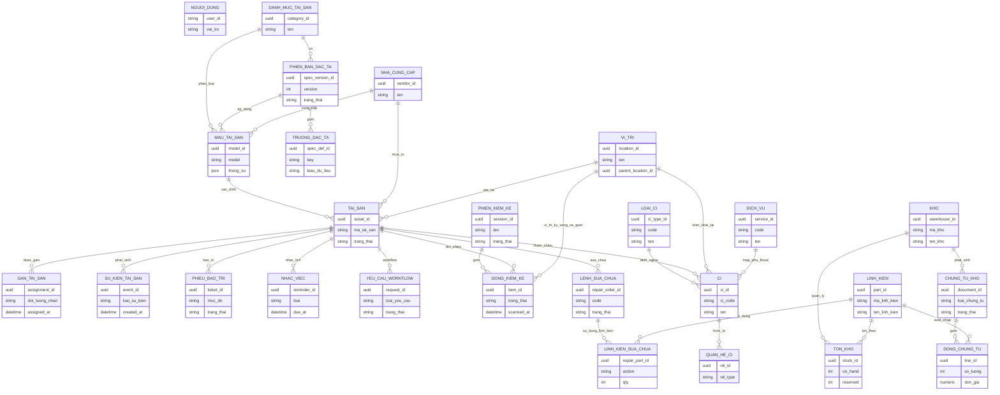
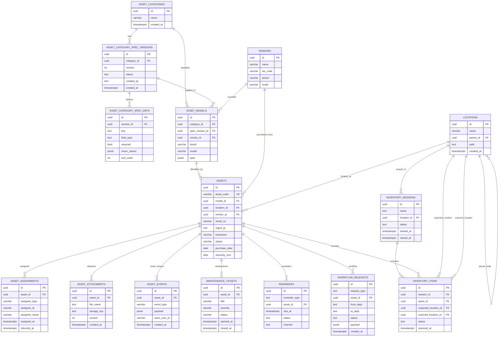
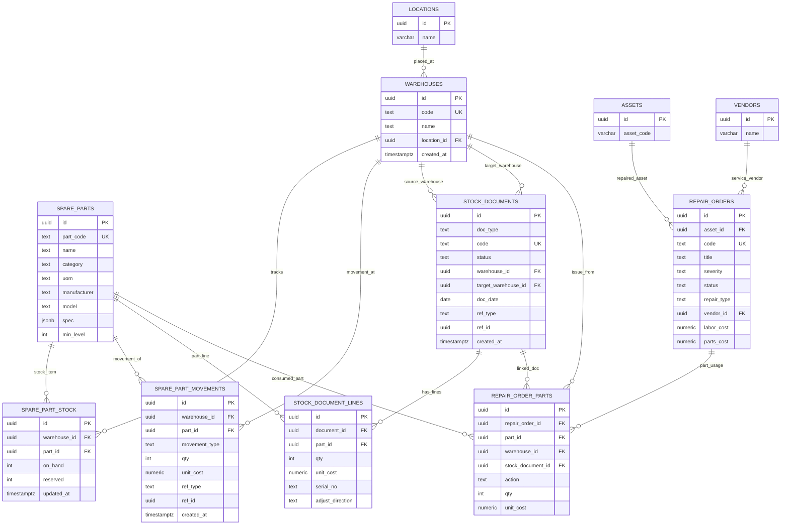
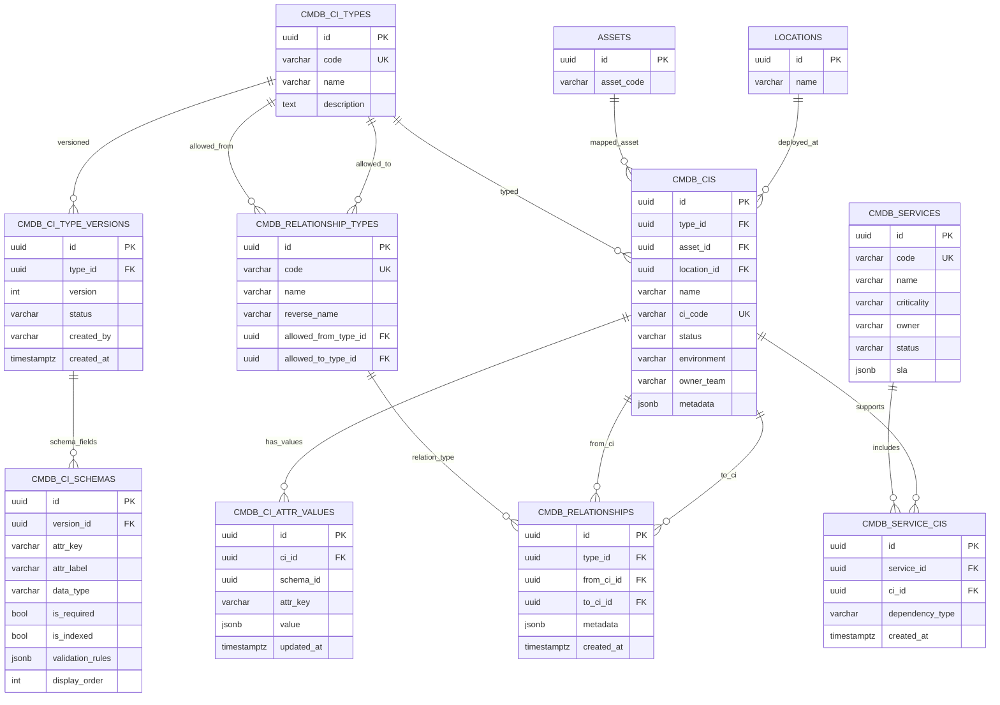

# CDM va LDM cho he thong QuanLyThietBi

Nguon doi chieu: `packages/infra-postgres/src/schema.sql` (trang thai hien tai).

## 1) CDM (Conceptual Data Model)

## 2) LDM (Logical Data Model)

### 2.1 Asset, Catalog, Inventory, Workflow

### 2.2 Warehouse va Repair

### 2.3 CMDB

## 3) Luu y quan trong

- So do LDM ben tren uu tien cac bang nghiep vu thiet bi/CMDB/kho; cac bang chat/AI telemetry (`conversations`, `messages`, `model_configs`, `usage_logs`, ...) chua dua vao de tranh qua tai so do.
- Trong schema hien tai, mot so cot mang nghia tham chieu nhung khong rang buoc FK DB-level (vi du: `cmdb_ci_attr_values.schema_id`, `asset_events.actor_user_id`, `created_by`, `approved_by`).
- Neu ban can LDM full 100% toan bo schema (bao gom chat + AI + setup/auth chi tiet), co the tach them 1-2 so do bo sung de de doc.
