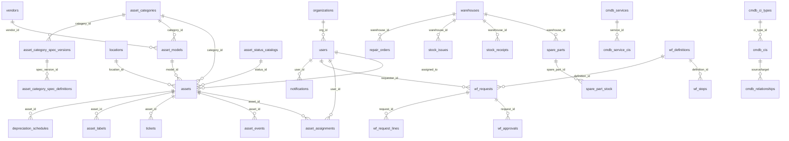

# Cơ sở dữ liệu

## Tổng quan

- **Engine:** PostgreSQL 16 (Alpine)
- **Database:** `qltb` (dev), `qltb_test` (test)
- **User:** `postgres` / `postgres`
- **Port:** 5432
- **Encoding:** UTF-8 (Vietnamese text sử dụng `E'\uXXXX'` escape strings)
- **Extensions:** `uuid-ossp` (UUID generation)

## Migration System

### Pipeline

```
pnpm db:reset = pnpm db:empty → pnpm db:migrate → pnpm db:seed
```

| Lệnh | Script | Mô tả |
|-------|--------|-------|
| `pnpm db:empty` | `scripts/db-empty.mjs` | DROP SCHEMA public CASCADE → CREATE SCHEMA → uuid-ossp |
| `pnpm db:migrate` | `scripts/db-migrate.mjs` | Chạy 42 migration files theo thứ tự |
| `pnpm db:seed` | `scripts/db-seed.mjs` | Chạy 3 seed files theo thứ tự |
| `pnpm db:reset` | — | Kết hợp cả 3 lệnh trên |

### Migration Files (42 files)

Migrations được chạy theo thứ tự cố định, chia thành 2 nguồn:

#### Base Schema + Package Migrations (11 files)

Từ `packages/infra-postgres/src/`:

| # | File | Mô tả |
|---|------|-------|
| 1 | `schema.sql` | Base schema — users, vendors, locations, assets, asset_models... |
| 2-11 | `migrations/020–042` | Organization, asset categories, specs, warehouse, events, tickets... |

#### DB Migrations (31 files)

Từ `db/migrations/`:

| File | Module |
|------|--------|
| `007_cmdb_core.sql` | CMDB core tables (CI types, CIs, relationships, services) |
| `025_add_asset_spec.sql` | Asset specification columns |
| `026_phase1_workflow_foundation.sql` | Workflow foundation (requests, approvals) |
| `030_licenses_module.sql` | License management tables |
| `031_accessories_module.sql` | Accessory management tables |
| `032_consumables_module.sql` | Consumable management tables |
| `033_components_module.sql` | Component management tables |
| `034_checkout_module.sql` | Checkout tracking tables |
| `035_requests_module.sql` | Request & approval system |
| `036_audit_module.sql` | Audit trail tables |
| `037_labels_module.sql` | Label/barcode management |
| `038_depreciation_module.sql` | Asset depreciation tracking |
| `039_reports_alerts_module.sql` | Reports, dashboards, alerts |
| `040_messaging_hub.sql` | Messaging & notification hub |
| `041_asset_status_catalog.sql` | Asset status catalog |
| `042_workflow_automation.sql` | Workflow automation engine |
| `043_analytics_dashboard.sql` | Analytics dashboard tables |
| `044_cmdb_enhancement.sql` | CMDB enhancements (impact rules, discovery) |
| `045_integration_hub.sql` | External integration hub |
| `046_security_compliance.sql` | Security & compliance module |
| `047_documents_module.sql` | Document management |
| `048_rename_spec_defs_table.sql` | Rename spec definitions table |
| `049_warehouse_improvements.sql` | Warehouse improvements |
| `050_rbac_permissions.sql` | RBAC permission system |
| `051_rbac_ad_model.sql` | RBAC Active Directory model |
| `052_wf_module.sql` | Re-designed workflow module |
| `053_inv_enhancements.sql` | Inventory enhancements |
| `054_asset_warehouse_link.sql` | Asset-warehouse linking |
| `055_stock_receipt_issue_enhancements.sql` | Stock receipt/issue improvements |
| `056_wf_request_lines.sql` | Workflow request line items |
| `057_wf_enhancements.sql` | Workflow final enhancements |

### Quy tắc Migration

1. **Chỉ DDL** — Migration không chứa seed data (INSERT). Seed data đặt trong `db/seed-*.sql`
2. **Đánh số tăng dần** — File mới dùng số tiếp theo (ví dụ: `058_xxx.sql`)
3. **Không xóa migration cũ** — Chỉ thêm migration mới để sửa
4. **IF NOT EXISTS / IF EXISTS** — Dùng guard clauses để migration idempotent khi có thể

## Seed Data

### Thứ tự thực thi

```
1. seed-data.sql              → Foundation data (users, statuses, locations...)
2. seed-assets-management.sql → Asset management data (~40 tables)
3. seed-qlts-demo.sql         → CMDB & workflow demo data
```

### seed-data.sql — Dữ liệu nền tảng

| Bảng | Số lượng | Mô tả |
|------|----------|-------|
| `users` | 8 | admin, it_manager, warehouse_keeper, user, accountant, technician, requester, viewer |
| `asset_status_catalogs` | 8 | Mới, Đang sử dụng, Bảo trì, Hỏng, Thanh lý, Lưu kho, Đang vận chuyển, Chờ xử lý |
| `locations` | 8 | Phòng CNTT, Phòng Nhân sự, Kho chính, Phòng Kỹ thuật... |
| `vendors` | 10 | Dell, HP, Lenovo, Apple, Samsung... |
| `suppliers` | 4 | Nhà cung cấp thiết bị IT, Nhà cung cấp vật tư... |
| `cmdb_ci_types` | 12 | Server, Router, Switch, Firewall, Database, Application... |
| `cmdb_relationship_types` | 8 | Phụ thuộc vào, Kết nối tới, Chứa, Cài đặt trên... |
| `organizations` | 3 | Bệnh viện 121, Chi nhánh Hà Nội, Chi nhánh Đà Nẵng |

**UUID Conventions:**
- Users: `00000000-0000-0000-0000-00000000000X`
- Statuses: `c0100000-0000-0000-0000-00000000000X`
- Locations: `a0000000-0000-0000-0000-00000000000X`
- Vendors: `b0000000-0000-0000-0000-00000000000X`
- Suppliers: `b1000000-0000-0000-0000-00000000000X`
- Organizations: `d0000000-0000-0000-0000-00000000000X`

### seed-assets-management.sql — Quản lý tài sản

48 phần, bao gồm:

| Nhóm | Bảng |
|------|------|
| **Danh mục** | asset_categories, asset_category_spec_versions, asset_category_spec_definitions, asset_models |
| **Tài sản** | assets, asset_assignments, asset_events |
| **Bảo trì** | tickets (maintenance requests) |
| **Kho** | warehouses, spare_parts, spare_part_stock, repair_orders, repair_order_items |
| **Giấy phép** | licenses, license_seats |
| **Phụ kiện** | accessories, accessory_checkouts |
| **Vật tư tiêu hao** | consumables, consumable_issues |
| **Linh kiện** | components, component_assets |
| **Kế hoạch mua sắm** | purchase_plans, purchase_plan_items |
| **Khấu hao** | depreciation_schedules |
| **Nhãn** | asset_labels |
| **Tài liệu** | documents, document_tags |
| **Kiểm kê** | audit_sessions, audit_items |
| **Báo cáo** | saved_reports |
| **Cảnh báo** | alert_rules |
| **Dashboard** | dashboard_widgets |
| **Tự động hóa** | automation_rules |
| **Thông báo** | notifications |
| **Lịch trình** | scheduled_tasks |
| **Yêu cầu** | wf_requests |
| **Nhắc nhở** | reminders |
| **Nhập/Xuất kho** | stock_receipts, stock_receipt_items, stock_issues, stock_issue_items |

### seed-qlts-demo.sql — CMDB & Workflow

| Nhóm | Bảng | Số lượng |
|------|------|----------|
| **CMDB** | cmdb_cis | 26 CIs |
| | cmdb_ci_type_versions | 8 versions |
| | cmdb_ci_schemas | Schema definitions |
| | cmdb_ci_attribute_values | Attribute values |
| | cmdb_relationships | 20 relationships |
| | cmdb_services | 6 services |
| | cmdb_service_cis | Service-CI links |
| **Smart Tags** | smart_tags, cmdb_ci_tags | 5 tags |
| **Impact** | cmdb_impact_rules | 3 rules |
| **Discovery** | cmdb_discovery_rules | 2 rules |
| **Change** | cmdb_change_assessments | 2 assessments |
| **Workflow** | wf_definitions | 4 definitions |
| | wf_steps | 6 steps |
| | wf_requests | 3 requests |
| | wf_approvals | 3 approvals |
| | wf_request_lines | 3 request lines |

## Vietnamese Encoding

Tất cả text tiếng Việt trong seed files sử dụng PostgreSQL escape strings `E'\uXXXX'` để đảm bảo encoding UTF-8 chính xác qua mọi hệ thống:

```sql
-- Ví dụ
INSERT INTO locations (id, name) VALUES
('a0000000-...', E'Ph\u00F2ng CNTT');
-- "Phòng CNTT"
```

**Bảng mã Unicode thường dùng:**

| Ký tự | Mã | Ký tự | Mã | Ký tự | Mã |
|-------|-----|-------|-----|-------|-----|
| ă | \u0103 | ắ | \u1EAF | ằ | \u1EB1 |
| â | \u00E2 | ấ | \u1EA5 | ầ | \u1EA7 |
| đ | \u0111 | Đ | \u0110 | é | \u00E9 |
| ê | \u00EA | ế | \u1EBF | ề | \u1EC1 |
| ệ | \u1EC7 | ễ | \u1EC5 | ị | \u1ECB |
| ô | \u00F4 | ố | \u1ED1 | ồ | \u1ED3 |
| ộ | \u1ED9 | ổ | \u1ED5 | ỗ | \u1ED7 |
| ơ | \u01A1 | ờ | \u1EDD | ở | \u1EDF |
| ư | \u01B0 | ứ | \u1EE9 | ừ | \u1EEB |
| ự | \u1EF1 | ữ | \u1EEF | ử | \u1EED |
| ạ | \u1EA1 | ả | \u1EA3 | ọ | \u1ECD |
| ũ | \u0169 | ỹ | \u1EF9 | á | \u00E1 |
| à | \u00E0 | ò | \u00F2 | ù | \u00F9 |

## ER Diagram — Các bảng chính


