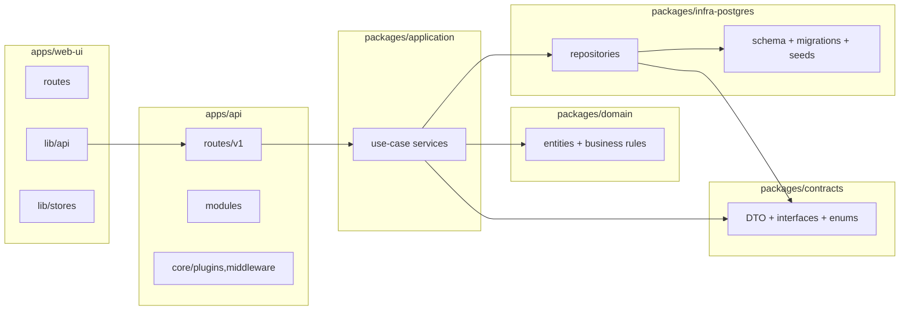
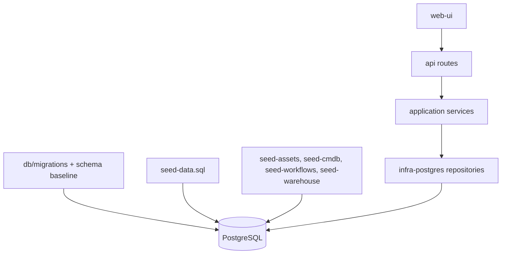
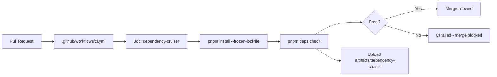

# Project Map Chi Tiet - QuanLyThietBi

Date: 2026-04-10
Scope: Toan bo monorepo (apps, packages, db, tests) + map dependency bang Dependency Cruiser.

## 1. Tong quan monorepo

```text
QuanLyThietBi/
├── apps/
│   ├── api/        # Fastify backend
│   └── web-ui/     # SvelteKit frontend
├── packages/
│   ├── contracts/
│   ├── domain/
│   ├── application/
│   └── infra-postgres/
├── db/             # migrations + seeds
├── tests/          # playwright + api/ui tests
├── artifacts/      # outputs, reports
└── docs/
```

## 2. Layer map (chi tiet theo clean architecture)



## 3. API map (apps/api/src)

### 3.1 Core

- core/
  - app.ts
  - server.ts
  - middleware/
  - plugins/
- shared/
  - config/
  - errors/
  - middleware/
  - schemas/
  - security/
  - types/
  - utils/

### 3.2 Route groups (apps/api/src/routes/v1)

- accessories
- admin
- analytics
- assets
- audit
- auth
- automation
- chat
- checkout
- cmdb
- communications
- components
- consumables
- depreciation
- documents
- field-kit
- integrations
- inventory
- labels
- licenses
- maintenance
- organizations
- print
- reports
- security
- user
- warehouse
- wf

### 3.3 Legacy/other modules (apps/api/src/modules)

- admin
- auth
- entitlements
- health
- qlts
- reports

## 4. Web UI map (apps/web-ui/src)

### 4.1 Route map

```text
routes/
├── +layout.svelte
├── +layout.ts
├── +page.svelte
├── (assets)/
├── chat/
├── forbidden/
├── inbox/
├── login/
├── logout/
├── notifications/
├── print/
├── setup/
└── [legacy]/
```

### 4.2 lib map

- lib/admin
- lib/api
- lib/assets
- lib/auth
- lib/cmdb
- lib/components
- lib/config
- lib/domain
- lib/i18n
- lib/mocks
- lib/netops
- lib/rbac
- lib/reports
- lib/setup
- lib/stores
- lib/styles
- lib/tools
- lib/types
- lib/utils
- lib/warehouse

## 5. Packages map (business layers)

### 5.1 packages/application/src

- accessories
- analytics
- assets
- audit
- automation
- change
- checkout
- cmdb
- compliance
- components
- consumables
- core
- depreciation
- documents
- fieldKit
- incident
- integration
- knowledge
- labels
- licenses
- maintenanceWarehouse
- organizations
- print
- rbac
- wf

### 5.2 packages/contracts/src

- accessories
- assets
- audit
- chat
- checkout
- cmdb
- components
- consumables
- depreciation
- documents
- equipmentGroups
- events
- fieldKit
- labels
- licenses
- llm
- maintenanceWarehouse
- mcp
- netops
- observability
- organizations
- print
- rbac
- repositories
- types
- wf
- workflow

### 5.3 packages/domain/src

- assets
- automation
- change
- cmdb
- compliance
- core
- incident
- knowledge
- maintenanceWarehouse
- rbac
- types

### 5.4 packages/infra-postgres/src

- PgClient.ts
- repositories/
- schema.sql
- migrations/
- seeds/

## 6. Database map (db)

### 6.1 Migration and seed structure

- db/migrations/
- db/seed-data.sql
- db/seed-assets-management.sql
- db/seed-cmdb.sql
- db/seed-workflows.sql
- db/seed-rbac-classic.sql
- db/seed-rbac-policies.sql
- db/seed-warehouse.sql
- db/seed-all.sql

### 6.2 Data flow



## 7. Dependency Cruiser map (thuc te tu report)

### 7.1 So lieu tong hop

- Modules cruised: 454
- Dependencies cruised: 644
- Root split:
  - apps: 232 modules
  - packages: 222 modules
- Layer split:
  - apps/api/src/routes/v1: 73 modules
  - packages/application/src: 68 modules
  - packages/contracts/src: 55 modules
  - packages/domain/src: 32 modules
  - packages/infra-postgres/src: 66 modules

### 7.2 Rule map dang enforce

- no-circular (error)
- no-test-imports-into-runtime (error)
- domain-should-not-depend-on-upper-layers (error)
- contracts-should-not-depend-on-app-or-infra (error)
- application-should-not-depend-on-apps (error)
- api-routes-should-not-import-infra-directly (error)
- web-ui-should-not-import-api-source (error)
- not-to-unresolvable (error)

### 7.3 Artifact map

- artifacts/dependency-cruiser/report.html
- artifacts/dependency-cruiser/report.json
- artifacts/dependency-cruiser/graph.dot
- artifacts/dependency-cruiser/graph.mmd

## 8. CI map cho dependency gate



## 9. Cac lenh map nhanh

- Kiem tra dependency gate:
  - pnpm deps:check
- Tao report JSON:
  - pnpm deps:json
- Tao report HTML:
  - pnpm deps:html
- Tao graph DOT:
  - pnpm deps:graph
- Tao graph Mermaid truc tiep:
  - pnpm exec depcruise apps/api/src apps/web-ui/src packages --config .dependency-cruiser.cjs --output-type mermaid --output-to artifacts/dependency-cruiser/graph.mmd

## 10. Ghi chu su dung map

- Map nay uu tien dung cho architecture review, onboarding, va impact analysis.
- De xuong chi tiet hon nua theo module, co the tach them:
  - docs/maps/map-assets.md
  - docs/maps/map-cmdb.md
  - docs/maps/map-warehouse.md
  - docs/maps/map-rbac.md
