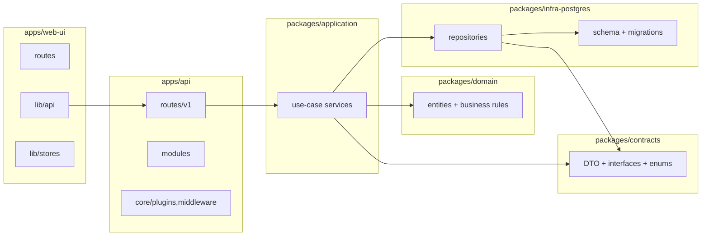

# Project Map — QuanLyThietBi

Cập nhật: 2026-04-10. Map toàn bộ modules, packages, dependency rules.

## 1. Monorepo structure

```text
QuanLyThietBi/
├── apps/
│   ├── api/        # @qltb/api — Fastify 5 backend
│   └── web-ui/     # @qltb/web-ui — SvelteKit SPA
├── packages/
│   ├── contracts/      # @qltb/contracts
│   ├── domain/         # @qltb/domain
│   ├── application/    # @qltb/application
│   └── infra-postgres/ # @qltb/infra-postgres
├── db/             # migrations + 19 seed files
├── tests/          # Playwright API + UI tests
├── artifacts/      # dependency-cruiser reports
└── docs/
```

## 2. Layer map



## 3. API map (apps/api/src)

### Core

```text
core/
  app.ts          createApp() — register plugins, hooks, modules
  server.ts       startServer() — DB connect, listen
  middleware/     auth hook, error handler, request hooks
  plugins/
shared/
  errors/         NotFoundError, ValidationError, ForbiddenError, ...
  utils/          response.utils.ts, pagination, ...
  security/
  schemas/
```

### Route groups (apps/api/src/routes/v1)

```text
accessories        /api/v1/accessories
admin              /api/v1/admin          users, roles, RBAC-AD, orgs
analytics          /api/v1/analytics
assets             /api/v1/assets         + catalogs, import, attachments, category-specs
audit              /api/v1/audit
auth               /api/v1/auth           login, refresh, logout
automation         /api/v1/automation
chat               /api/v1/chat
checkout           /api/v1/checkout
cmdb               /api/v1/cmdb
communications     /api/v1/communications
components         /api/v1/components
consumables        /api/v1/consumables
depreciation       /api/v1/depreciation
documents          /api/v1/documents
field-kit          /api/v1/field-kit
integrations       /api/v1/integrations
inventory          /api/v1/inventory
labels             /api/v1/labels
licenses           /api/v1/licenses
maintenance        /api/v1/maintenance
organizations      /api/v1/organizations
print              /api/v1/print
reports            /api/v1/reports        + reminders
security           /api/v1/security
user               /api/v1/user
warehouse          /api/v1/warehouse
wf                 /api/v1/wf             workflow requests + approvals
```

### Legacy modules (apps/api/src/modules)

```text
admin, auth, entitlements, health, qlts, reports
```

## 4. Web UI map (apps/web-ui/src)

### Route map

```text
routes/
├── +layout.svelte          auth gate + sidebar shell
├── (assets)/
│   ├── admin/              users, roles, organizations
│   ├── analytics/          dashboard, cost analysis
│   ├── assets/             tài sản: CRUD, detail, catalogs, purchase plans
│   ├── automation/
│   ├── cmdb/               CI list, detail, topology graph
│   ├── depreciation/
│   ├── help/
│   ├── inbox/              approval inbox
│   ├── integrations/
│   ├── inventory/
│   ├── maintenance/        tickets, repair orders
│   ├── me/                 assets của tôi, requests của tôi
│   ├── reports/
│   ├── requests/           quản lý yêu cầu (manager view)
│   ├── security/
│   ├── settings/
│   └── warehouse/          kho, phiếu, tồn kho
├── chat/
├── forbidden/
├── login/
├── logout/
├── notifications/
├── print/
└── setup/
```

### lib map

```text
lib/
  admin/          admin UI helpers
  api/            ~30 HTTP client modules (assets.ts, warehouse.ts, wf.ts, ...)
  assets/         components/WfRequestLineEditor, AddAssetModal, ...
  auth/           capabilities.ts — client-side RBAC matrix
  cmdb/           TopologyGraph.svelte (Cytoscape)
  components/     AppSidebar, ToastHost, NotificationCenter, Button, Table, ...
  config/
  domain/
  i18n/           svelte-i18n setup + locales/vi/* + locales/en/*
  mocks/
  rbac/           RBAC engine helpers
  reports/
  setup/
  stores/         themeStore, effectivePermsStore, orgStore, authStore
  styles/         tokens.css — design tokens
  types/
  utils/
  warehouse/      StockDocumentLines.svelte (dual-mode line editor)
```

## 5. Packages map

### packages/application/src

```text
accessories, analytics, assets, audit, automation, change, checkout, cmdb,
compliance, components, consumables, core, depreciation, documents, fieldKit,
incident, integration, knowledge, labels, licenses, maintenanceWarehouse,
organizations, print, rbac, wf
```

### packages/contracts/src

```text
accessories, assets, audit, chat, checkout, cmdb, components, consumables,
depreciation, documents, equipmentGroups, events, fieldKit, labels, licenses,
llm, maintenanceWarehouse, mcp, netops, observability, organizations, print,
rbac, repositories, types, wf, workflow
```

### packages/domain/src

```text
assets, automation, change, cmdb, compliance, core, incident, knowledge,
maintenanceWarehouse, rbac, types
```

### packages/infra-postgres/src

```text
PgClient.ts
repositories/     40+ Repo classes (AssetRepo, WfRepo, StockDocumentRepo, ...)
schema.sql        squashed baseline (DDL đến 2026-04-07)
migrations/       (archive — đã squash)
```

## 6. Database map

### Migration structure

```text
db/migrations/
  archive/              migrations 007–20260326 (đã squash vào schema.sql)
  065_equipment_groups.sql
  (migration mới tiếp theo từ 066_xxx.sql)
```

### Seed files (thứ tự chạy)

```text
 1. seed-data.sql               foundation: users, locations, vendors
 2. seed-rbac-classic.sql       classic RBAC matrix
 3. seed-rbac-policies.sql      policy library
 4. seed-assets-management.sql  asset catalog: models, warehouses, spare parts
 5. seed-assets.sql             50 assets + assignments + repair orders
 6. seed-accessories.sql        accessories, consumables, components, licenses
 7. seed-warehouse.sql          stock documents, purchase plans
 8. seed-analytics.sql          reports, dashboards
 9. seed-chat-ai.sql            AI providers, models
10. seed-ops.sql                alerts, notifications
11. seed-ad-rbac-resources.sql  AD RBAC resources
12. seed-qlts-demo.sql          CMDB CIs, wf_definitions
13. seed-workflows.sql          wf_requests, automation rules
14. seed-inventory-audit.sql    inventory sessions, documents
15. seed-depreciation-2026.sql  depreciation schedules
16. seed-new-features.sql       org hierarchy, spare part stock
17. seed-cmdb-config-files.sql  CMDB config files
18. seed-my-pages.sql           OU→org mappings, wf_requests for admin
19. seed-pc001.sql              PC-001 repairs, components, documents
```

## 7. Dependency rules (enforce bởi Dependency Cruiser)

| Rule | Severity |
| --- | --- |
| no-circular | error |
| no-test-imports-into-runtime | error |
| domain-should-not-depend-on-upper-layers | error |
| contracts-should-not-depend-on-app-or-infra | error |
| application-should-not-depend-on-apps | error |
| api-routes-should-not-import-infra-directly | error |
| web-ui-should-not-import-api-source | error |
| not-to-unresolvable | error |

Kiểm tra:

```bash
pnpm deps:check     # fail nếu có vi phạm
pnpm deps:html      # HTML report → artifacts/dependency-cruiser/report.html
pnpm deps:json      # JSON → artifacts/dependency-cruiser/report.json
pnpm deps:graph     # DOT graph → artifacts/dependency-cruiser/graph.dot
```

## 8. RBAC / Capabilities matrix

Roles hệ thống: `root`, `admin`, `super_admin`, `it_asset_manager`, `warehouse_keeper`, `technician`, `requester`, `user`, `viewer`.

Capabilities (client-side, `lib/auth/capabilities.ts`):

```text
assets:      read, create, update, delete, export, import, assign
categories:  read, manage
cmdb:        read, create, update, delete
warehouse:   read, create, approve
inventory:   read, create, manage
licenses:    read, manage
accessories: read, manage
consumables: read, manage
components:  read, manage
checkout:    read, create, approve
requests:    read, create, approve
maintenance: read, create, manage
reports:     read, export
analytics:   read
depreciation:read, manage
labels:      read, manage
documents:   read, upload, delete
automation:  read, manage
integrations:read, manage
security:    read, manage
admin:       users, roles, settings
```

## 9. Asset lifecycle

```text
[Phiếu nhập kho — receipt]
  Post → tạo Asset record (status: in_stock, warehouseId: kho nhận)

[Phiếu xuất kho — issue]
  Post → cập nhật Asset (status: in_use, warehouseId: null)
  ⚠️ Không tạo assignment — trách nhiệm của "Gán tài sản"

[Gán tài sản — AssignModal]
  Thủ công → tạo asset_assignment (assignee: person/department/system)
```

Phân tách:

- **Phiếu kho** = quản lý vật lý (asset ở kho nào)
- **Gán tài sản** = quản lý sử dụng (asset do ai dùng)
