# Sơ đồ tuần tự - QuanLyThietBi

Nguồn đối chiếu:
- `apps/api/src/routes/**`
- `apps/api/src/modules/qlts/routes/**`
- `packages/application/src/**`

## Ma trận bao phủ

| Miền nghiệp vụ | Route/service chính được bao phủ | Mã sơ đồ |
|---|---|---|
| Trình thiết lập | setup routes + SetupService | SD-01..SD-03 |
| Xác thực | auth routes | SD-04..SD-06 |
| Tài sản cốt lõi | assets routes + AssetService | SD-07..SD-10 |
| Tệp đính kèm | attachments routes + AttachmentService | SD-11 |
| Danh mục + đặc tả nhóm | catalogs routes + category-spec routes + CatalogService + CategorySpecService | SD-12..SD-13 |
| Bảo trì | maintenance routes + MaintenanceService | SD-14 |
| Kiểm kê | inventory routes + InventoryService | SD-15 |
| Quy trình (tài sản) | workflow routes + WorkflowService | SD-16 |
| Nhắc việc | reminders routes + ReminderService | SD-17 |
| Danh mục kho + xem tồn | warehouse routes + WarehouseCatalogService + StockService | SD-18 |
| Chứng từ kho + sổ cái | stock-document routes + StockDocumentService | SD-19 |
| Báo cáo kho | reports routes + StockReportService | SD-20 |
| Sửa chữa kho | RepairService | SD-21 |
| CMDB schema + CI + quan hệ + dịch vụ + báo cáo | cmdb routes + SchemaService + CiService + RelationshipService + ServiceMappingService + report services | SD-22..SD-26 |
| Trao đổi | communications routes (notifications/inbox) | SD-27..SD-28 |
| QLTS kế hoạch mua sắm | purchasePlans routes + qlts WorkflowService + PurchaseSuggestionService | SD-29 |
| QLTS tăng tài sản | assetIncreases routes + qlts WorkflowService | SD-30 |

## Trình hướng dẫn thiết lập

### SD-01 Trạng thái thiết lập

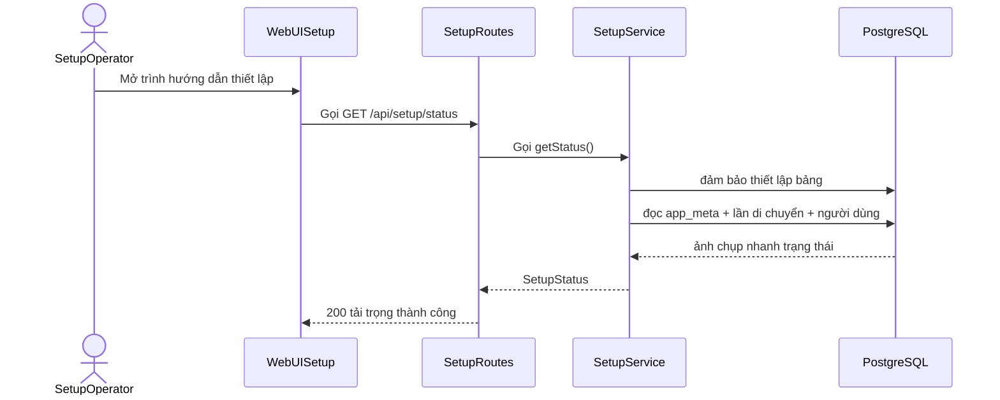
```mermaid
sequenceDiagram
    actor Admin as SetupOperator
    participant UI as WebUISetup
    participant API as SetupRoutes
    participant SS as SetupService
    participant DB as PostgreSQL

    Admin->>UI: Mở trình hướng dẫn thiết lập
    UI->>API: Gọi GET /api/setup/status
    API->>SS: Gọi getStatus()
    SS->>DB: đảm bảo thiết lập bảng
    SS->>DB: đọc app_meta + lần di chuyển + người dùng
    DB-->>SS: ảnh chụp nhanh trạng thái
    SS-->>API: SetupStatus
    API-->>UI: 200 tải trọng thành công
```

### SD-02 Chạy di chuyển không đồng bộ + công việc thăm dò ý kiến

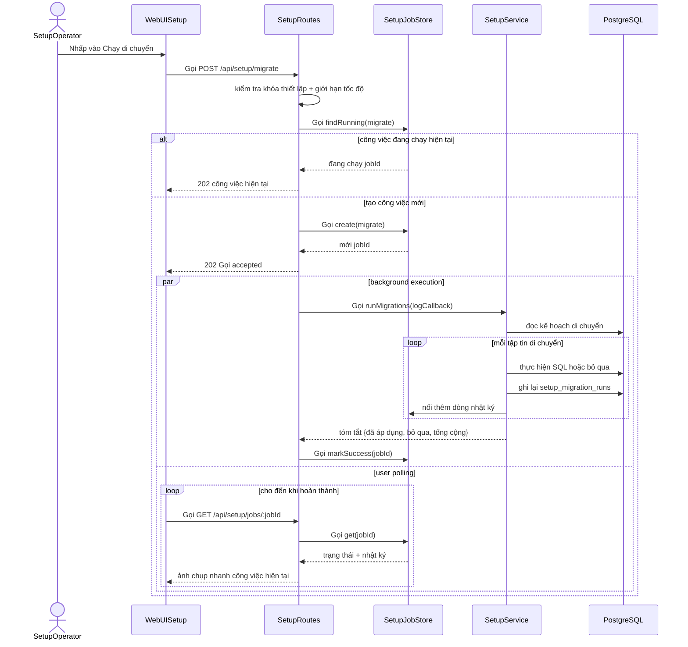
```mermaid
sequenceDiagram
    actor Admin as SetupOperator
    participant UI as WebUISetup
    participant API as SetupRoutes
    participant JOB as SetupJobStore
    participant SS as SetupService
    participant DB as PostgreSQL

    Admin->>UI: Nhấp vào Chạy di chuyển
    UI->>API: Gọi POST /api/setup/migrate
    API->>API: kiểm tra khóa thiết lập + giới hạn tốc độ
    API->>JOB: Gọi findRunning(migrate)

    alt công việc đang chạy hiện tại
        JOB-->>API: đang chạy jobId
        API-->>UI: 202 công việc hiện tại
    else tạo công việc mới
        API->>JOB: Gọi create(migrate)
        JOB-->>API: mới jobId
        API-->>UI: 202 Gọi accepted

        par background execution
            API->>SS: Gọi runMigrations(logCallback)
            SS->>DB: đọc kế hoạch di chuyển
            loop mỗi tập tin di chuyển
                SS->>DB: thực hiện SQL hoặc bỏ qua
                SS->>DB: ghi lại setup_migration_runs
                SS->>JOB: nối thêm dòng nhật ký
            end
            SS-->>API: tóm tắt {đã áp dụng, bỏ qua, tổng cộng}
            API->>JOB: Gọi markSuccess(jobId)
        and user polling
            loop cho đến khi hoàn thành
                UI->>API: Gọi GET /api/setup/jobs/:jobId
                API->>JOB: Gọi get(jobId)
                JOB-->>API: trạng thái + nhật ký
                API-->>UI: ảnh chụp nhanh công việc hiện tại
            end
        end
    end
```

### SD-03 Tạo quản trị viên đầu tiên và hoàn thiện

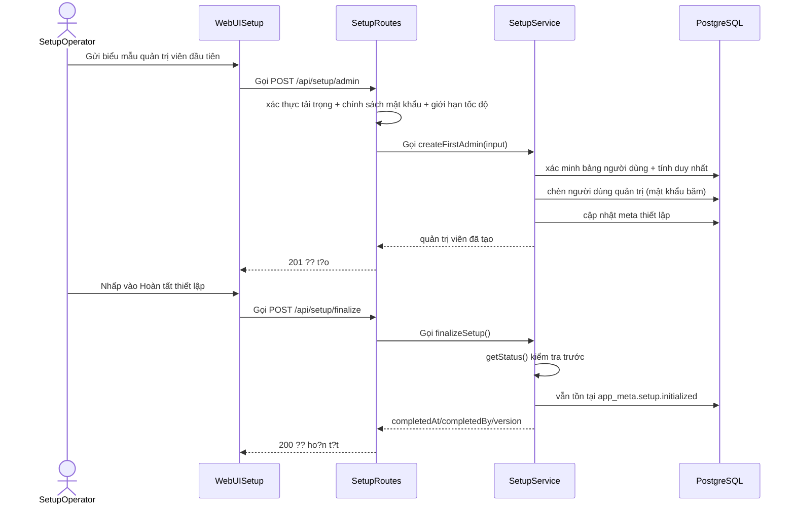
```mermaid
sequenceDiagram
    actor Admin as SetupOperator
    participant UI as WebUISetup
    participant API as SetupRoutes
    participant SS as SetupService
    participant DB as PostgreSQL

    Admin->>UI: Gửi biểu mẫu quản trị viên đầu tiên
    UI->>API: Gọi POST /api/setup/admin
    API->>API: xác thực tải trọng + chính sách mật khẩu + giới hạn tốc độ
    API->>SS: Gọi createFirstAdmin(input)
    SS->>DB: xác minh bảng người dùng + tính duy nhất
    SS->>DB: chèn người dùng quản trị (mật khẩu băm)
    SS->>DB: cập nhật meta thiết lập
    SS-->>API: quản trị viên đã tạo
    API-->>UI: 201 ?? t?o

    Admin->>UI: Nhấp vào Hoàn tất thiết lập
    UI->>API: Gọi POST /api/setup/finalize
    API->>SS: Gọi finalizeSetup()
    SS->>SS: getStatus() kiểm tra trước
    SS->>DB: vẫn tồn tại app_meta.setup.initialized
    SS-->>API: completedAt/completedBy/version
    API-->>UI: 200 ?? ho?n t?t
```

## Xác thực

### SD-04 Đăng nhập

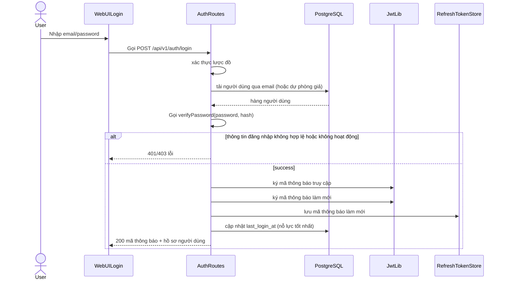
```mermaid
sequenceDiagram
    actor User
    participant UI as WebUILogin
    participant API as AuthRoutes
    participant DB as PostgreSQL
    participant JWT as JwtLib
    participant STORE as RefreshTokenStore

    User->>UI: Nhập email/password
    UI->>API: Gọi POST /api/v1/auth/login
    API->>API: xác thực lược đồ
    API->>DB: tải người dùng qua email (hoặc dự phòng giả)
    DB-->>API: hàng người dùng
    API->>API: Gọi verifyPassword(password, hash)

    alt thông tin đăng nhập không hợp lệ hoặc không hoạt động
        API-->>UI: 401/403 lỗi
    else success
        API->>JWT: ký mã thông báo truy cập
        API->>JWT: ký mã thông báo làm mới
        API->>STORE: lưu mã thông báo làm mới
        API->>DB: cập nhật last_login_at (nỗ lực tốt nhất)
        API-->>UI: 200 mã thông báo + hồ sơ người dùng
    end
```

### SD-05 Làm mới mã thông báo

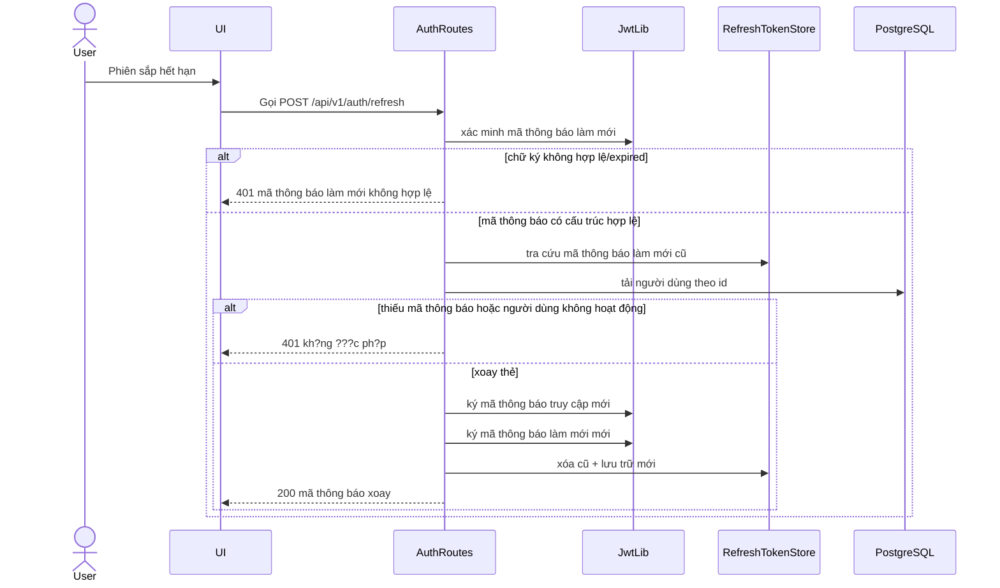
```mermaid
sequenceDiagram
    actor User
    participant UI
    participant API as AuthRoutes
    participant JWT as JwtLib
    participant STORE as RefreshTokenStore
    participant DB as PostgreSQL

    User->>UI: Phiên sắp hết hạn
    UI->>API: Gọi POST /api/v1/auth/refresh
    API->>JWT: xác minh mã thông báo làm mới

    alt chữ ký không hợp lệ/expired
        API-->>UI: 401 mã thông báo làm mới không hợp lệ
    else mã thông báo có cấu trúc hợp lệ
        API->>STORE: tra cứu mã thông báo làm mới cũ
        API->>DB: tải người dùng theo id
        alt thiếu mã thông báo hoặc người dùng không hoạt động
            API-->>UI: 401 kh?ng ???c ph?p
        else xoay thẻ
            API->>JWT: ký mã thông báo truy cập mới
            API->>JWT: ký mã thông báo làm mới mới
            API->>STORE: xóa cũ + lưu trữ mới
            API-->>UI: 200 mã thông báo xoay
        end
    end
```

### SD-06 Nhận người dùng hiện tại (/ tôi)

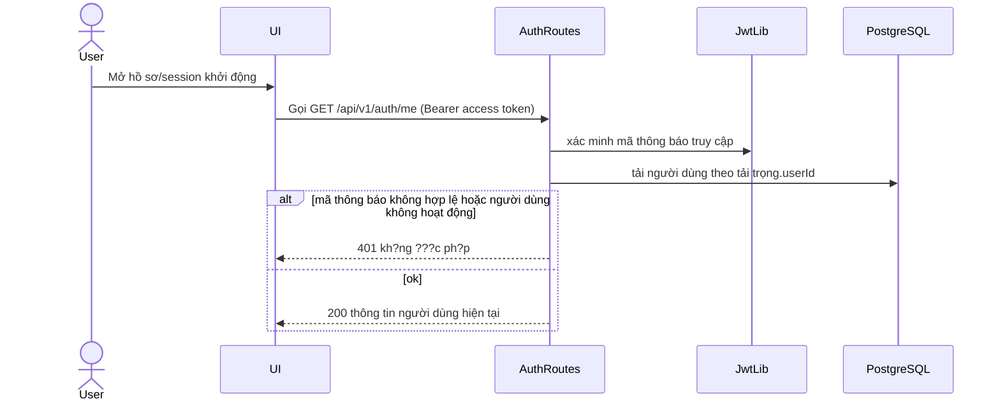
```mermaid
sequenceDiagram
    actor User
    participant UI
    participant API as AuthRoutes
    participant JWT as JwtLib
    participant DB as PostgreSQL

    User->>UI: Mở hồ sơ/session khởi động
    UI->>API: Gọi GET /api/v1/auth/me (Bearer access token)
    API->>JWT: xác minh mã thông báo truy cập
    API->>DB: tải người dùng theo tải trọng.userId

    alt mã thông báo không hợp lệ hoặc người dùng không hoạt động
        API-->>UI: 401 kh?ng ???c ph?p
    else ok
        API-->>UI: 200 thông tin người dùng hiện tại
    end
```
## Tài sản cốt lõi

### SD-07 Danh sách tài sản/tìm kiếm/xuất + số lượng trạng thái

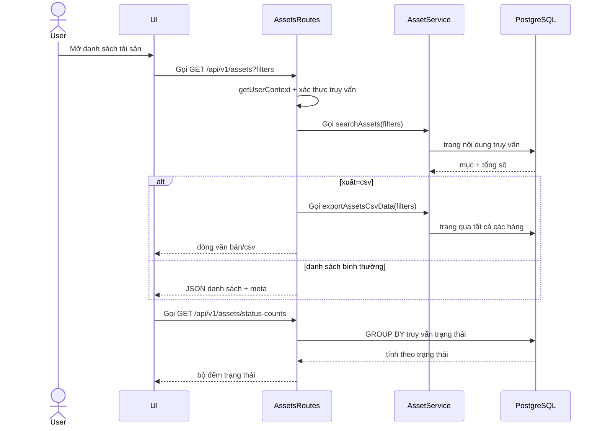
```mermaid
sequenceDiagram
    actor User
    participant UI
    participant API as AssetsRoutes
    participant AS as AssetService
    participant DB as PostgreSQL

    User->>UI: Mở danh sách tài sản
    UI->>API: Gọi GET /api/v1/assets?filters
    API->>API: getUserContext + xác thực truy vấn
    API->>AS: Gọi searchAssets(filters)
    AS->>DB: trang nội dung truy vấn
    DB-->>AS: mục + tổng số

    alt xuất=csv
        API->>AS: Gọi exportAssetsCsvData(filters)
        AS->>DB: trang qua tất cả các hàng
        API-->>UI: dòng văn bản/csv
    else danh sách bình thường
        API-->>UI: JSON danh sách + meta
    end

    UI->>API: Gọi GET /api/v1/assets/status-counts
    API->>DB: GROUP BY truy vấn trạng thái
    DB-->>API: tính theo trạng thái
    API-->>UI: bộ đếm trạng thái
```

### SD-08 Tạo/cập nhật nội dung

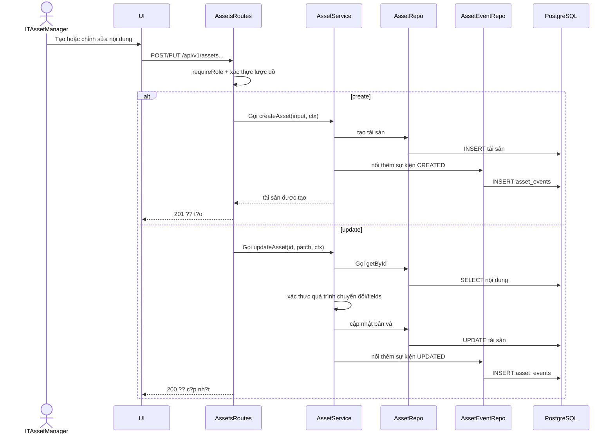
```mermaid
sequenceDiagram
    actor Manager as ITAssetManager
    participant UI
    participant API as AssetsRoutes
    participant AS as AssetService
    participant AR as AssetRepo
    participant EV as AssetEventRepo
    participant DB as PostgreSQL

    Manager->>UI: Tạo hoặc chỉnh sửa nội dung
    UI->>API: POST/PUT /api/v1/assets...
    API->>API: requireRole + xác thực lược đồ

    alt create
        API->>AS: Gọi createAsset(input, ctx)
        AS->>AR: tạo tài sản
        AR->>DB: INSERT tài sản
        AS->>EV: nối thêm sự kiện CREATED
        EV->>DB: INSERT asset_events
        AS-->>API: tài sản được tạo
        API-->>UI: 201 ?? t?o
    else update
        API->>AS: Gọi updateAsset(id, patch, ctx)
        AS->>AR: Gọi getById
        AR->>DB: SELECT nội dung
        AS->>AS: xác thực quá trình chuyển đổi/fields
        AS->>AR: cập nhật bản vá
        AR->>DB: UPDATE tài sản
        AS->>EV: nối thêm sự kiện UPDATED
        EV->>DB: INSERT asset_events
        API-->>UI: 200 ?? c?p nh?t
    end
```

### SD-09 Các hành động trong vòng đời của tài sản (gán/trả lại/di chuyển/trạng thái)

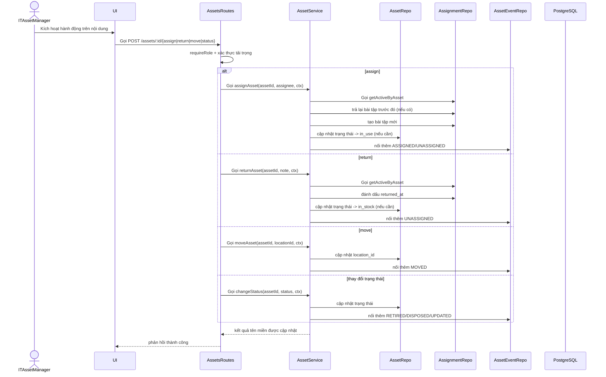
```mermaid
sequenceDiagram
    actor Manager as ITAssetManager
    participant UI
    participant API as AssetsRoutes
    participant AS as AssetService
    participant AR as AssetRepo
    participant AGR as AssignmentRepo
    participant EV as AssetEventRepo
    participant DB as PostgreSQL

    Manager->>UI: Kích hoạt hành động trên nội dung
    UI->>API: Gọi POST /assets/:id/{assign|return|move|status}
    API->>API: requireRole + xác thực tải trọng

    alt assign
        API->>AS: Gọi assignAsset(assetId, assignee, ctx)
        AS->>AGR: Gọi getActiveByAsset
        AS->>AGR: trả lại bài tập trước đó (nếu có)
        AS->>AGR: tạo bài tập mới
        AS->>AR: cập nhật trạng thái -> in_use (nếu cần)
        AS->>EV: nối thêm ASSIGNED/UNASSIGNED
    else return
        API->>AS: Gọi returnAsset(assetId, note, ctx)
        AS->>AGR: Gọi getActiveByAsset
        AS->>AGR: đánh dấu returned_at
        AS->>AR: cập nhật trạng thái -> in_stock (nếu cần)
        AS->>EV: nối thêm UNASSIGNED
    else move
        API->>AS: Gọi moveAsset(assetId, locationId, ctx)
        AS->>AR: cập nhật location_id
        AS->>EV: nối thêm MOVED
    else thay đổi trạng thái
        API->>AS: Gọi changeStatus(assetId, status, ctx)
        AS->>AR: cập nhật trạng thái
        AS->>EV: nối thêm RETIRED/DISPOSED/UPDATED
    end

    AS-->>API: kết quả tên miền được cập nhật
    API-->>UI: phản hồi thành công
```

### SD-10 Xem trước/cam kết nhập nội dung

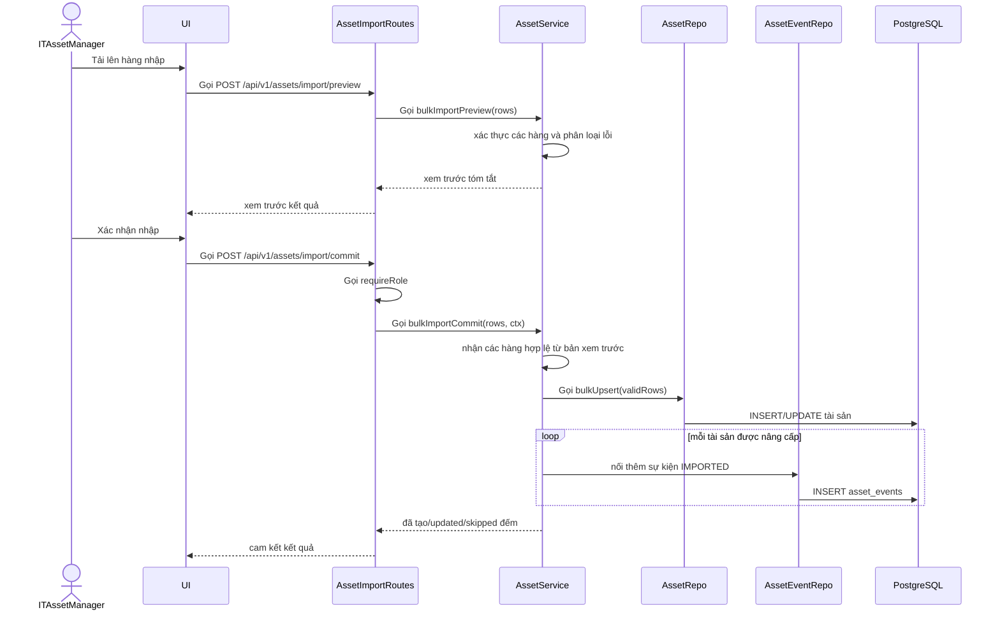
```mermaid
sequenceDiagram
    actor Manager as ITAssetManager
    participant UI
    participant API as AssetImportRoutes
    participant AS as AssetService
    participant AR as AssetRepo
    participant EV as AssetEventRepo
    participant DB as PostgreSQL

    Manager->>UI: Tải lên hàng nhập
    UI->>API: Gọi POST /api/v1/assets/import/preview
    API->>AS: Gọi bulkImportPreview(rows)
    AS->>AS: xác thực các hàng và phân loại lỗi
    AS-->>API: xem trước tóm tắt
    API-->>UI: xem trước kết quả

    Manager->>UI: Xác nhận nhập
    UI->>API: Gọi POST /api/v1/assets/import/commit
    API->>API: Gọi requireRole
    API->>AS: Gọi bulkImportCommit(rows, ctx)
    AS->>AS: nhận các hàng hợp lệ từ bản xem trước
    AS->>AR: Gọi bulkUpsert(validRows)
    AR->>DB: INSERT/UPDATE tài sản
    loop mỗi tài sản được nâng cấp
        AS->>EV: nối thêm sự kiện IMPORTED
        EV->>DB: INSERT asset_events
    end
    AS-->>API: đã tạo/updated/skipped đếm
    API-->>UI: cam kết kết quả
```

### SD-11 Tải lên/danh sách/tải xuống tệp đính kèm

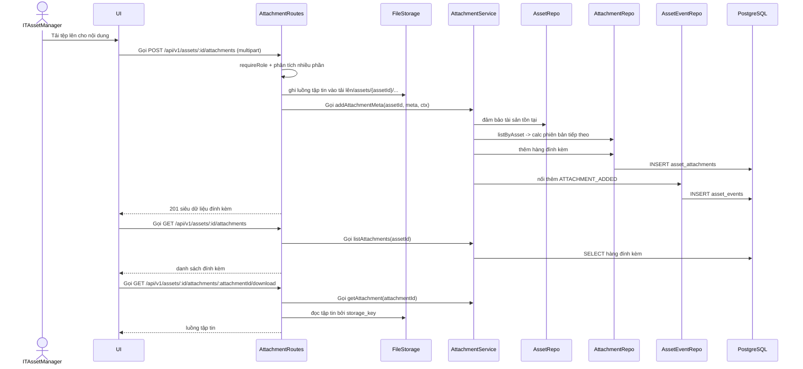
```mermaid
sequenceDiagram
    actor Manager as ITAssetManager
    participant UI
    participant API as AttachmentRoutes
    participant FS as FileStorage
    participant ATS as AttachmentService
    participant AR as AssetRepo
    participant ATR as AttachmentRepo
    participant EV as AssetEventRepo
    participant DB as PostgreSQL

    Manager->>UI: Tải tệp lên cho nội dung
    UI->>API: Gọi POST /api/v1/assets/:id/attachments (multipart)
    API->>API: requireRole + phân tích nhiều phần
    API->>FS: ghi luồng tập tin vào tải lên/assets/{assetId}/...
    API->>ATS: Gọi addAttachmentMeta(assetId, meta, ctx)
    ATS->>AR: đảm bảo tài sản tồn tại
    ATS->>ATR: listByAsset -> calc phiên bản tiếp theo
    ATS->>ATR: thêm hàng đính kèm
    ATR->>DB: INSERT asset_attachments
    ATS->>EV: nối thêm ATTACHMENT_ADDED
    EV->>DB: INSERT asset_events
    API-->>UI: 201 siêu dữ liệu đính kèm

    UI->>API: Gọi GET /api/v1/assets/:id/attachments
    API->>ATS: Gọi listAttachments(assetId)
    ATS->>DB: SELECT hàng đính kèm
    API-->>UI: danh sách đính kèm

    UI->>API: Gọi GET /api/v1/assets/:id/attachments/:attachmentId/download
    API->>ATS: Gọi getAttachment(attachmentId)
    API->>FS: đọc tập tin bởi storage_key
    API-->>UI: luồng tập tin
```

## Danh mục và đặc tả nhóm tài sản

### SD-12 Danh mục CRUD (danh mục/nhà cung cấp/model/địa điểm)

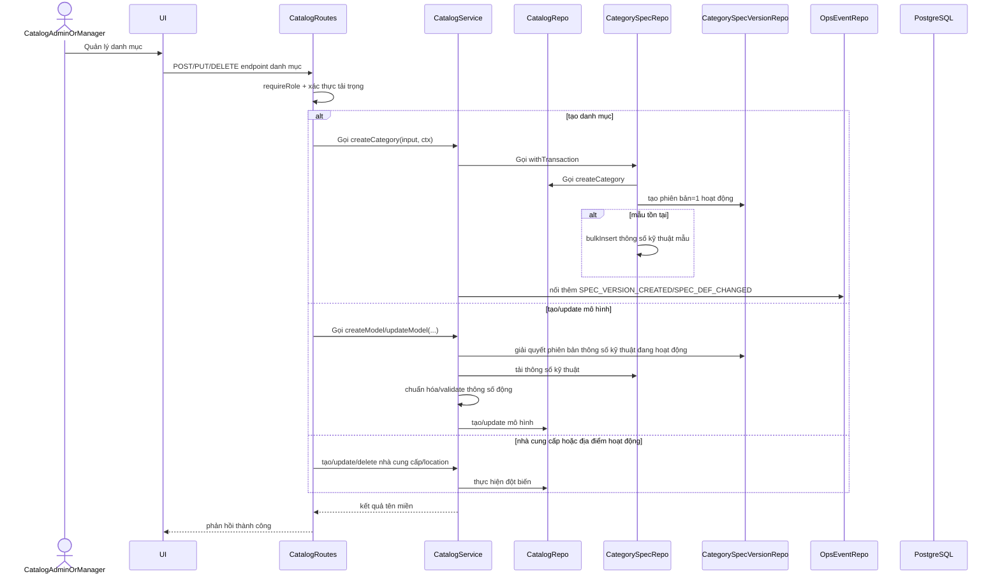
```mermaid
sequenceDiagram
    actor Admin as CatalogAdminOrManager
    participant UI
    participant API as CatalogRoutes
    participant CS as CatalogService
    participant CR as CatalogRepo
    participant SR as CategorySpecRepo
    participant VR as CategorySpecVersionRepo
    participant OPS as OpsEventRepo
    participant DB as PostgreSQL

    Admin->>UI: Quản lý danh mục
    UI->>API: POST/PUT/DELETE endpoint danh mục
    API->>API: requireRole + xác thực tải trọng

    alt tạo danh mục
        API->>CS: Gọi createCategory(input, ctx)
        CS->>SR: Gọi withTransaction
        SR->>CR: Gọi createCategory
        SR->>VR: tạo phiên bản=1 hoạt động
        alt mẫu tồn tại
            SR->>SR: bulkInsert thông số kỹ thuật mẫu
        end
        CS->>OPS: nối thêm SPEC_VERSION_CREATED/SPEC_DEF_CHANGED
    else tạo/update mô hình
        API->>CS: Gọi createModel/updateModel(...)
        CS->>VR: giải quyết phiên bản thông số kỹ thuật đang hoạt động
        CS->>SR: tải thông số kỹ thuật
        CS->>CS: chuẩn hóa/validate thông số động
        CS->>CR: tạo/update mô hình
    else nhà cung cấp hoặc địa điểm hoạt động
        API->>CS: tạo/update/delete nhà cung cấp/location
        CS->>CR: thực hiện đột biến
    end

    CS-->>API: kết quả tên miền
    API-->>UI: phản hồi thành công
```

### SD-13 Quản lý định nghĩa và phiên bản thông số danh mục

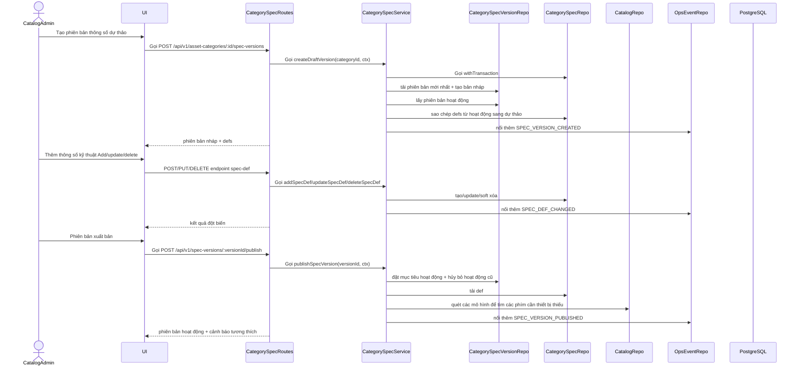
```mermaid
sequenceDiagram
    actor Admin as CatalogAdmin
    participant UI
    participant API as CategorySpecRoutes
    participant SS as CategorySpecService
    participant VR as CategorySpecVersionRepo
    participant SR as CategorySpecRepo
    participant CR as CatalogRepo
    participant OPS as OpsEventRepo
    participant DB as PostgreSQL

    Admin->>UI: Tạo phiên bản thông số dự thảo
    UI->>API: Gọi POST /api/v1/asset-categories/:id/spec-versions
    API->>SS: Gọi createDraftVersion(categoryId, ctx)
    SS->>SR: Gọi withTransaction
    SS->>VR: tải phiên bản mới nhất + tạo bản nháp
    SS->>VR: lấy phiên bản hoạt động
    SS->>SR: sao chép defs từ hoạt động sang dự thảo
    SS->>OPS: nối thêm SPEC_VERSION_CREATED
    API-->>UI: phiên bản nháp + defs

    Admin->>UI: Thêm thông số kỹ thuật Add/update/delete
    UI->>API: POST/PUT/DELETE endpoint spec-def
    API->>SS: Gọi addSpecDef/updateSpecDef/deleteSpecDef
    SS->>SR: tạo/update/soft xóa
    SS->>OPS: nối thêm SPEC_DEF_CHANGED
    API-->>UI: kết quả đột biến

    Admin->>UI: Phiên bản xuất bản
    UI->>API: Gọi POST /api/v1/spec-versions/:versionId/publish
    API->>SS: Gọi publishSpecVersion(versionId, ctx)
    SS->>VR: đặt mục tiêu hoạt động + hủy bỏ hoạt động cũ
    SS->>SR: tải def
    SS->>CR: quét các mô hình để tìm các phím cần thiết bị thiếu
    SS->>OPS: nối thêm SPEC_VERSION_PUBLISHED
    API-->>UI: phiên bản hoạt động + cảnh báo tương thích
```
## Bảo trì, kiểm kê, quy trình

### SD-14 Phiếu bảo trì mở/đóng

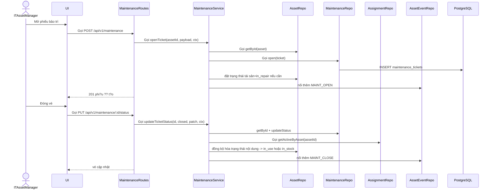
```mermaid
sequenceDiagram
    actor Manager as ITAssetManager
    participant UI
    participant API as MaintenanceRoutes
    participant MS as MaintenanceService
    participant AR as AssetRepo
    participant MR as MaintenanceRepo
    participant AGR as AssignmentRepo
    participant EV as AssetEventRepo
    participant DB as PostgreSQL

    Manager->>UI: Mở phiếu bảo trì
    UI->>API: Gọi POST /api/v1/maintenance
    API->>MS: Gọi openTicket(assetId, payload, ctx)
    MS->>AR: Gọi getById(asset)
    MS->>MR: Gọi open(ticket)
    MR->>DB: INSERT maintenance_tickets
    MS->>AR: đặt trạng thái tài sản=in_repair nếu cần
    MS->>EV: nối thêm MAINT_OPEN
    API-->>UI: 201 phi?u ?? t?o

    Manager->>UI: Đóng vé
    UI->>API: Gọi PUT /api/v1/maintenance/:id/status
    API->>MS: Gọi updateTicketStatus(id, closed, patch, ctx)
    MS->>MR: getById + updateStatus
    MS->>AGR: Gọi getActiveByAsset(assetId)
    MS->>AR: đồng bộ hóa trạng thái nội dung -> in_use hoặc in_stock
    MS->>EV: nối thêm MAINT_CLOSE
    API-->>UI: vé cập nhật
```

### SD-15 Phiên kiểm kê tạo/quét/đóng/báo cáo

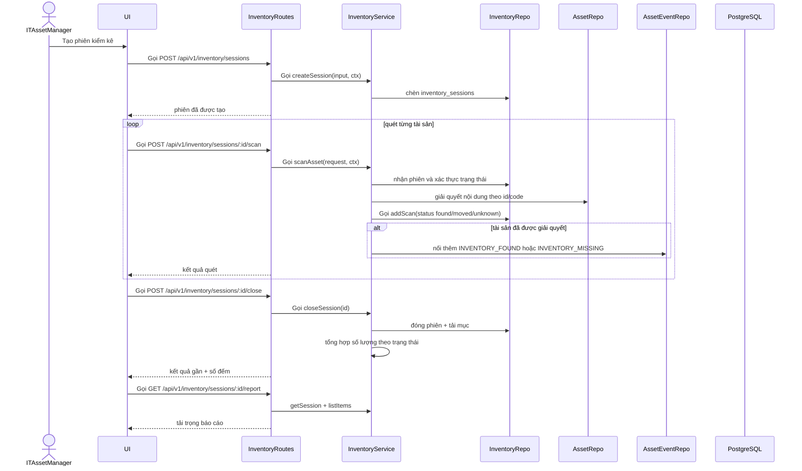
```mermaid
sequenceDiagram
    actor Manager as ITAssetManager
    participant UI
    participant API as InventoryRoutes
    participant IS as InventoryService
    participant IR as InventoryRepo
    participant AR as AssetRepo
    participant EV as AssetEventRepo
    participant DB as PostgreSQL

    Manager->>UI: Tạo phiên kiểm kê
    UI->>API: Gọi POST /api/v1/inventory/sessions
    API->>IS: Gọi createSession(input, ctx)
    IS->>IR: chèn inventory_sessions
    API-->>UI: phiên đã được tạo

    loop quét từng tài sản
        UI->>API: Gọi POST /api/v1/inventory/sessions/:id/scan
        API->>IS: Gọi scanAsset(request, ctx)
        IS->>IR: nhận phiên và xác thực trạng thái
        IS->>AR: giải quyết nội dung theo id/code
        IS->>IR: Gọi addScan(status found/moved/unknown)
        alt tài sản đã được giải quyết
            IS->>EV: nối thêm INVENTORY_FOUND hoặc INVENTORY_MISSING
        end
        API-->>UI: kết quả quét
    end

    UI->>API: Gọi POST /api/v1/inventory/sessions/:id/close
    API->>IS: Gọi closeSession(id)
    IS->>IR: đóng phiên + tải mục
    IS->>IS: tổng hợp số lượng theo trạng thái
    API-->>UI: kết quả gần + số đếm

    UI->>API: Gọi GET /api/v1/inventory/sessions/:id/report
    API->>IS: getSession + listItems
    API-->>UI: tải trọng báo cáo
```

### SD-16 Vòng đời yêu cầu quy trình làm việc của tài sản

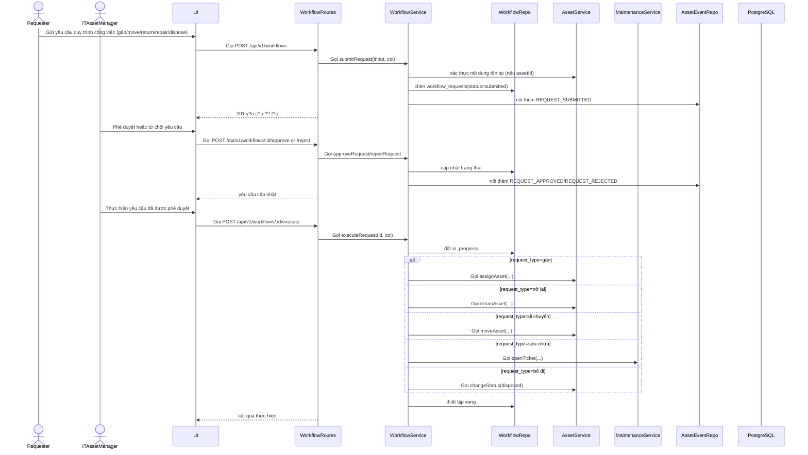
```mermaid
sequenceDiagram
    actor Requester
    actor Approver as ITAssetManager
    participant UI
    participant API as WorkflowRoutes
    participant WS as WorkflowService
    participant WR as WorkflowRepo
    participant AS as AssetService
    participant MS as MaintenanceService
    participant EV as AssetEventRepo
    participant DB as PostgreSQL

    Requester->>UI: Gửi yêu cầu quy trình công việc (gán/move/return/repair/dispose)
    UI->>API: Gọi POST /api/v1/workflows
    API->>WS: Gọi submitRequest(input, ctx)
    WS->>AS: xác thực nội dung tồn tại (nếu assetId)
    WS->>WR: chèn workflow_requests(status=submitted)
    WS->>EV: nối thêm REQUEST_SUBMITTED
    API-->>UI: 201 y?u c?u ?? t?o

    Approver->>UI: Phê duyệt hoặc từ chối yêu cầu
    UI->>API: Gọi POST /api/v1/workflows/:id/approve or /reject
    API->>WS: Gọi approveRequest/rejectRequest
    WS->>WR: cập nhật trạng thái
    WS->>EV: nối thêm REQUEST_APPROVED/REQUEST_REJECTED
    API-->>UI: yêu cầu cập nhật

    Approver->>UI: Thực hiện yêu cầu đã được phê duyệt
    UI->>API: Gọi POST /api/v1/workflows/:id/execute
    API->>WS: Gọi executeRequest(id, ctx)
    WS->>WR: đặt in_progress
    alt request_type=gán
        WS->>AS: Gọi assignAsset(...)
    else request_type=trở lại
        WS->>AS: Gọi returnAsset(...)
    else request_type=di chuyển
        WS->>AS: Gọi moveAsset(...)
    else request_type=sửa chữa
        WS->>MS: Gọi openTicket(...)
    else request_type=bỏ đi
        WS->>AS: Gọi changeStatus(disposed)
    end
    WS->>WR: thiết lập xong
    API-->>UI: kết quả thực hiện
```

### SD-17 Chạy nhắc nhở bảo hành và liệt kê

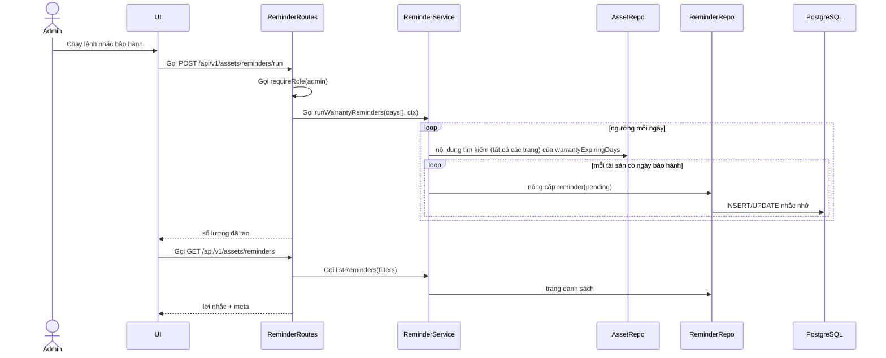
```mermaid
sequenceDiagram
    actor Admin
    participant UI
    participant API as ReminderRoutes
    participant RS as ReminderService
    participant AR as AssetRepo
    participant RR as ReminderRepo
    participant DB as PostgreSQL

    Admin->>UI: Chạy lệnh nhắc bảo hành
    UI->>API: Gọi POST /api/v1/assets/reminders/run
    API->>API: Gọi requireRole(admin)
    API->>RS: Gọi runWarrantyReminders(days[], ctx)
    loop ngưỡng mỗi ngày
        RS->>AR: nội dung tìm kiếm (tất cả các trang) của warrantyExpiringDays
        loop mỗi tài sản có ngày bảo hành
            RS->>RR: nâng cấp reminder(pending)
            RR->>DB: INSERT/UPDATE nhắc nhở
        end
    end
    API-->>UI: số lượng đã tạo

    UI->>API: Gọi GET /api/v1/assets/reminders
    API->>RS: Gọi listReminders(filters)
    RS->>RR: trang danh sách
    API-->>UI: lời nhắc + meta
```

## Kho, tồn kho, sửa chữa

### SD-18 Danh mục kho và phụ tùng + xem kho

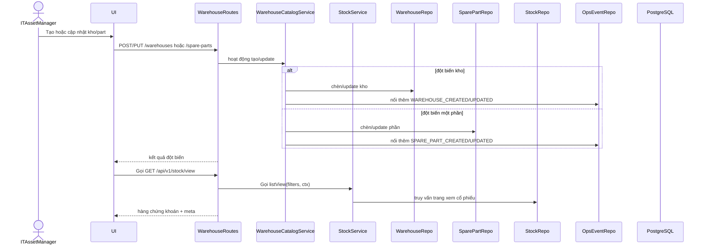
```mermaid
sequenceDiagram
    actor Manager as ITAssetManager
    participant UI
    participant API as WarehouseRoutes
    participant WCS as WarehouseCatalogService
    participant SS as StockService
    participant WR as WarehouseRepo
    participant PR as SparePartRepo
    participant STR as StockRepo
    participant OPS as OpsEventRepo
    participant DB as PostgreSQL

    Manager->>UI: Tạo hoặc cập nhật kho/part
    UI->>API: POST/PUT /warehouses hoặc /spare-parts
    API->>WCS: hoạt động tạo/update
    alt đột biến kho
        WCS->>WR: chèn/update kho
        WCS->>OPS: nối thêm WAREHOUSE_CREATED/UPDATED
    else đột biến một phần
        WCS->>PR: chèn/update phần
        WCS->>OPS: nối thêm SPARE_PART_CREATED/UPDATED
    end
    API-->>UI: kết quả đột biến

    UI->>API: Gọi GET /api/v1/stock/view
    API->>SS: Gọi listView(filters, ctx)
    SS->>STR: truy vấn trang xem cổ phiếu
    API-->>UI: hàng chứng khoán + meta
```

### SD-19 Vòng đời tài liệu chứng khoán (tạo/cập nhật/đăng/hủy)

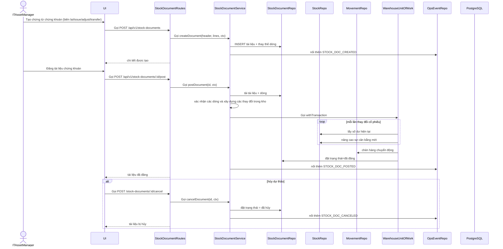
```mermaid
sequenceDiagram
    actor Manager as ITAssetManager
    participant UI
    participant API as StockDocumentRoutes
    participant SDS as StockDocumentService
    participant DOC as StockDocumentRepo
    participant STOCK as StockRepo
    participant MOV as MovementRepo
    participant UOW as WarehouseUnitOfWork
    participant OPS as OpsEventRepo
    participant DB as PostgreSQL

    Manager->>UI: Tạo chứng từ chứng khoán (biên lai/issue/adjust/transfer)
    UI->>API: Gọi POST /api/v1/stock-documents
    API->>SDS: Gọi createDocument(header, lines, ctx)
    SDS->>DOC: INSERT tài liệu + thay thế dòng
    SDS->>OPS: nối thêm STOCK_DOC_CREATED
    API-->>UI: chi tiết được tạo

    Manager->>UI: Đăng tài liệu chứng khoán
    UI->>API: Gọi POST /api/v1/stock-documents/:id/post
    API->>SDS: Gọi postDocument(id, ctx)
    SDS->>DOC: tải tài liệu + dòng
    SDS->>SDS: xác nhận các dòng và xây dựng các thay đổi trong kho

    SDS->>UOW: Gọi withTransaction
    loop mỗi lần thay đổi cổ phiếu
        UOW->>STOCK: lấy số dư hiện tại
        UOW->>STOCK: nâng cao sự cân bằng mới
    end
    UOW->>MOV: chèn hàng chuyển động
    UOW->>DOC: đặt trạng thái=đã đăng
    SDS->>OPS: nối thêm STOCK_DOC_POSTED
    API-->>UI: tài liệu đã đăng

    alt hủy dự thảo
        UI->>API: Gọi POST /stock-documents/:id/cancel
        API->>SDS: Gọi cancelDocument(id, ctx)
        SDS->>DOC: đặt trạng thái = đã hủy
        SDS->>OPS: nối thêm STOCK_DOC_CANCELED
        API-->>UI: tài liệu bị hủy
    end
```

### SD-20 Báo cáo kho

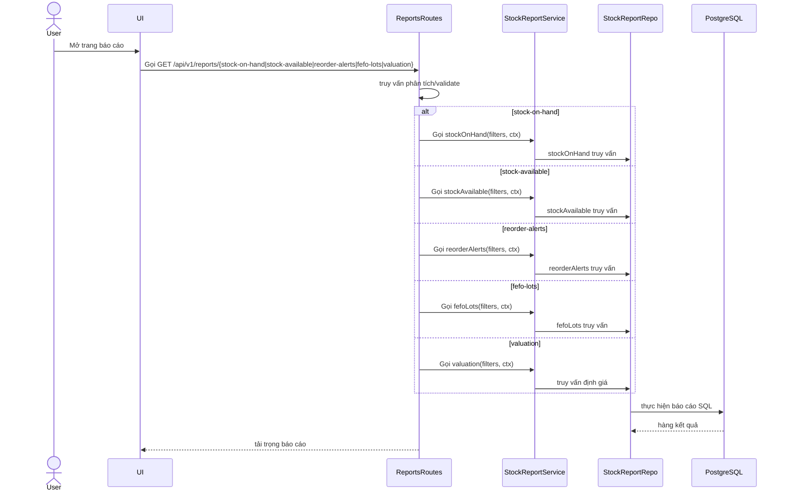
```mermaid
sequenceDiagram
    actor User
    participant UI
    participant API as ReportsRoutes
    participant RPS as StockReportService
    participant RPR as StockReportRepo
    participant DB as PostgreSQL

    User->>UI: Mở trang báo cáo
    UI->>API: Gọi GET /api/v1/reports/{stock-on-hand|stock-available|reorder-alerts|fefo-lots|valuation}
    API->>API: truy vấn phân tích/validate

    alt stock-on-hand
        API->>RPS: Gọi stockOnHand(filters, ctx)
        RPS->>RPR: stockOnHand truy vấn
    else stock-available
        API->>RPS: Gọi stockAvailable(filters, ctx)
        RPS->>RPR: stockAvailable truy vấn
    else reorder-alerts
        API->>RPS: Gọi reorderAlerts(filters, ctx)
        RPS->>RPR: reorderAlerts truy vấn
    else fefo-lots
        API->>RPS: Gọi fefoLots(filters, ctx)
        RPS->>RPR: fefoLots truy vấn
    else valuation
        API->>RPS: Gọi valuation(filters, ctx)
        RPS->>RPR: truy vấn định giá
    end

    RPR->>DB: thực hiện báo cáo SQL
    DB-->>RPR: hàng kết quả
    API-->>UI: tải trọng báo cáo
```

### SD-21 Đặt hàng sửa chữa và tiêu thụ linh kiện

```mermaid
sequenceDiagram
    actor Manager as ITAssetManager
    participant UI
    participant RS as RepairService
    participant UOW as WarehouseUnitOfWork
    participant RR as RepairOrderRepo
    participant RPR as RepairPartRepo
    participant DOC as StockDocumentRepo
    participant STOCK as StockRepo
    participant MOV as MovementRepo
    participant OPS as OpsEventRepo
    participant DB as PostgreSQL

    Manager->>UI: Tạo lệnh sửa chữa
    UI->>RS: Gọi createRepairOrder(input, ctx)
    RS->>RR: chèn lệnh sửa chữa
    RS->>OPS: nối thêm REPAIR_CREATED

    Manager->>UI: Thêm bộ phận sửa chữa từ kho kho
    UI->>RS: Gọi addRepairPart(orderId, partInput, ctx)
    RS->>RR: lệnh sửa chữa tải
    RS->>UOW: Gọi withTransaction
    UOW->>DOC: tạo tài liệu chứng khoán phát hành + dòng
    UOW->>STOCK: kiểm tra và giảm on_hand
    UOW->>MOV: thêm vào phong trào
    UOW->>DOC: thiết lập tài liệu chứng khoán đã đăng
    UOW->>RPR: thêm liên kết repair_order_part
    UOW->>RR: tính toán lại và cập nhật parts_cost
    RS->>OPS: nối thêm REPAIR_PART_ADDED

    Manager->>UI: Đóng sửa chữa
    UI->>RS: Gọi changeStatus(orderId, closed, ctx)
    RS->>RR: trạng thái cập nhật + closedAt
    RS->>OPS: nối thêm REPAIR_STATUS_CHANGED
```
## CMDB

### SD-22 Vòng đời phiên bản loại/lược đồ CMDB

```mermaid
sequenceDiagram
    actor Admin as CatalogAdmin
    participant UI
    participant API as CmdbRoutes
    participant SS as SchemaService
    participant TR as CiTypeRepo
    participant VR as CiTypeVersionRepo
    participant DR as CiSchemaRepo
    participant OPS as OpsEventRepo
    participant DB as PostgreSQL

    Admin->>UI: Tạo loại CI
    UI->>API: Gọi POST /api/v1/cmdb/types
    API->>SS: Gọi createType(input, ctx)
    SS->>TR: chèn cmdb_ci_types
    SS->>OPS: nối thêm CMDB_TYPE_CREATED
    API-->>UI: loại đã tạo

    Admin->>UI: Tạo phiên bản loại dự thảo
    UI->>API: Gọi POST /api/v1/cmdb/types/:id/versions
    API->>SS: Gọi createDraftVersion(typeId, ctx)
    SS->>DR: bản sao giao dịch từ hoạt động
    SS->>VR: tạo phiên bản nháp mới
    SS->>OPS: nối thêm SPEC_VERSION_CREATED
    API-->>UI: phiên bản nháp + defs

    Admin->>UI: Phiên bản xuất bản
    UI->>API: Gọi POST /api/v1/cmdb/versions/:versionId/publish
    API->>SS: Gọi publishVersion(versionId, ctx)
    SS->>VR: kích hoạt mục tiêu + rút lui những người khác
    SS->>DR: tải defs cho cảnh báo
    SS->>OPS: nối thêm SPEC_VERSION_PUBLISHED
    API-->>UI: phiên bản hoạt động + cảnh báo tương thích
```

### SD-23 Tạo/cập nhật CI với các thuộc tính động

```mermaid
sequenceDiagram
    actor Manager as ITAssetManager
    participant UI
    participant API as CmdbRoutes
    participant CS as CiService
    participant CIR as CiRepo
    participant VR as CiTypeVersionRepo
    participant DR as CiSchemaRepo
    participant AVR as CiAttrValueRepo
    participant OPS as OpsEventRepo
    participant DB as PostgreSQL

    Manager->>UI: Tạo CI
    UI->>API: Gọi POST /api/v1/cmdb/cis
    API->>CS: Gọi createCi(payload, attributes, ctx)
    CS->>VR: nhận phiên bản hoạt động theo loại
    CS->>DR: danh sách thuộc tính defs
    CS->>CS: xác thực các thuộc tính chống lại defs
    CS->>CIR: chèn hàng CI
    CS->>AVR: upsertMany giá trị thuộc tính
    CS->>OPS: nối thêm CI_CREATED
    API-->>UI: CI chi tiết

    Manager->>UI: Cập nhật CI
    UI->>API: Gọi PUT /api/v1/cmdb/cis/:id
    API->>CS: Gọi updateCi(id, patch, attributes, ctx)
    CS->>CIR: tải + cập nhật CI
    CS->>VR: phiên bản hoạt động
    CS->>DR: Gọi defs
    alt thuộc tính được cung cấp
        CS->>AVR: Gọi upsertMany
    else không có thuộc tính
        CS->>AVR: liệt kê các giá trị hiện có
    end
    CS->>OPS: nối thêm CI_UPDATED
    API-->>UI: đã cập nhật chi tiết CI
```

### SD-24 Quản lý mối quan hệ và truy vấn cấu trúc liên kết

```mermaid
sequenceDiagram
    actor Manager as ITAssetManager
    actor Viewer as User
    participant UI
    participant API as CmdbRoutes
    participant RS as RelationshipService
    participant RTR as RelationshipTypeRepo
    participant RR as RelationshipRepo
    participant CIR as CiRepo
    participant OPS as OpsEventRepo
    participant DB as PostgreSQL

    Manager->>UI: Tạo kiểu quan hệ
    UI->>API: Gọi POST /api/v1/cmdb/relationship-types
    API->>RS: Gọi createRelationshipType(input, ctx)
    RS->>RTR: chèn loại
    RS->>OPS: nối thêm REL_TYPE_CREATED
    API-->>UI: loại đã tạo

    Manager->>UI: Liên kết hai CI
    UI->>API: Gọi POST /api/v1/cmdb/relationships
    API->>RS: Gọi createRelationship(input, ctx)
    RS->>RTR: lấy kiểu quan hệ
    RS->>CIR: tải nguồn và đích CI
    RS->>RS: xác thực ghép nối loại được phép
    RS->>RR: chèn mối quan hệ
    RS->>OPS: nối thêm REL_CREATED
    API-->>UI: mối quan hệ được tạo ra

    Viewer->>UI: Xem biểu đồ/impact/path
    UI->>API: Gọi GET /cmdb/cis/:id/graph or /impact or /dependency-path
    API->>RS: Gọi getGraph/getImpactAnalysis/getDependencyPath
    RS->>RR: listByCi (lặp lại BFS)
    RS->>CIR: tải các CI lân cận
    API-->>UI: kết quả cấu trúc liên kết
```

### SD-25 Bản đồ dịch vụ và tác động

```mermaid
sequenceDiagram
    actor Manager as ITAssetManager
    actor Viewer as User
    participant UI
    participant API as CmdbRoutes
    participant SMS as ServiceMappingService
    participant SR as CmdbServiceRepo
    participant RS as RelationshipService
    participant OPS as OpsEventRepo
    participant DB as PostgreSQL

    Manager->>UI: Tạo dịch vụ và thêm thành viên CI
    UI->>API: Gọi POST /api/v1/cmdb/services
    API->>SMS: Gọi createService(input, ctx)
    SMS->>SR: chèn dịch vụ
    SMS->>OPS: nối thêm SERVICE_CREATED
    API-->>UI: dịch vụ đã tạo

    UI->>API: Gọi POST /api/v1/cmdb/services/:id/members
    API->>SMS: Gọi addMember(serviceId, ciId, ctx)
    SMS->>SR: chèn service_member
    SMS->>OPS: nối thêm SERVICE_MEMBER_ADDED
    API-->>UI: thành viên đã tạo

    Viewer->>UI: Phân tích tác động của dịch vụ
    UI->>API: Gọi GET /api/v1/cmdb/services/:id/impact
    API->>SMS: Gọi serviceImpact(serviceId, depth, direction)
    SMS->>SR: liệt kê thành viên dịch vụ
    loop mỗi thành viên CI
        SMS->>RS: Gọi getGraph(memberCiId,...)
    end
    SMS-->>API: biểu đồ tác động hợp nhất
    API-->>UI: cấu trúc liên kết tác động
```

### SD-26 Báo cáo và xuất CMDB

```mermaid
sequenceDiagram
    actor Viewer as User
    participant UI
    participant API as CmdbRoutes
    participant CIRS as CiInventoryReportService
    participant RAS as RelationshipAnalyticsService
    participant ATS as AuditTrailService
    participant EXP as ExporterCSVPDF

    Viewer->>UI: Mở báo cáo CMDB
    UI->>API: Gọi GET /api/v1/cmdb/reports/{ci-inventory|relationship-analytics|audit-trail}

    alt ci-inventory
        API->>CIRS: Gọi generateCiInventoryReport()
    else relationship-analytics
        API->>RAS: Gọi generateAnalyticsReport()
    else audit-trail
        API->>ATS: Gọi generateAuditTrailReport(filters)
    end

    API-->>UI: báo cáo JSON

    Viewer->>UI: Xuất báo cáo
    UI->>API: Gọi GET /api/v1/cmdb/reports/export/:reportType?format=csv|pdf|json
    API->>API: tạo dữ liệu báo cáo
    alt csv
        API->>EXP: xuất*ToCSV(reportData)
        API-->>UI: văn bản/csv đính kèm
    else pdf
        API->>EXP: xuất*ToPDF(reportData)
        API-->>UI: ứng dụng/pdf tệp đính kèm
    else json
        API-->>UI: Gọi application/json
    end
```
## Trao đổi

### SD-27 Nguồn cấp dữ liệu thông báo và đánh dấu đã đọc

```mermaid
sequenceDiagram
    actor User
    participant UI
    participant API as CommunicationRoutes
    participant DB as PostgreSQL
    participant MEM as InMemoryReadMap

    User->>UI: Mở thông báo
    UI->>API: Gọi GET /api/v1/notifications
    API->>API: getUserContext + xác thực phân trang
    API->>DB: UNION lời nhắc truy vấn + workflow_requests
    DB-->>API: c?c b?n ghi
    API->>MEM: kiểm tra bộ nhớ đệm đã đọc trên mỗi id thông báo
    API-->>UI: danh sách có cờ đọc

    User->>UI: Đánh dấu một cái là đã đọc
    UI->>API: Gọi POST /api/v1/notifications/:id/read
    API->>MEM: Gọi rememberReadNotification(userId, id)
    API-->>UI: đọc=true + dấu thời gian
```

### SD-28 Danh sách hộp thư đến/chi tiết/trả lời

```mermaid
sequenceDiagram
    actor User
    participant UI
    participant API as CommunicationRoutes
    participant DB as PostgreSQL

    User->>UI: Mở chủ đề hộp thư đến
    UI->>API: Gọi GET /api/v1/inbox
    API->>API: phạm vi ủy quyền (own/all theo vai trò)
    API->>DB: SELECT cuộc trò chuyện + tin nhắn mới nhất
    DB-->>API: hàng chủ đề
    API-->>UI: danh sách hộp thư đến

    User->>UI: Mở chi tiết chủ đề
    UI->>API: Gọi GET /api/v1/inbox/:id
    API->>DB: xác minh quyền truy cập chủ đề
    API->>DB: SELECT tin nhắn của conversation_id
    API-->>UI: chủ đề + tin nhắn

    User->>UI: Gửi trả lời
    UI->>API: Gọi POST /api/v1/inbox/:id/reply
    API->>DB: xác minh quyền truy cập
    API->>DB: INSERT messages(role=user)
    API->>DB: UPDATE cuộc trò chuyện.message_count + updated_at
    API-->>UI: 201 tin nhắn đã tạo
```

## QLTS (Kế hoạch mua sắm và tăng tài sản)

### SD-29 Vòng đời của kế hoạch mua hàng (đề xuất/tạo/gửi/phê duyệt/đăng/hủy)

```mermaid
sequenceDiagram
    actor Planner
    actor Approver
    participant UI
    participant API as PurchasePlanRoutes
    participant SG as PurchaseSuggestionService
    participant WF as QLTSWorkflowService
    participant PPR as PurchasePlanRepo
    participant APR as ApprovalRepo
    participant DB as PostgreSQL

    Planner->>UI: Nhận đề xuất tự động
    UI->>API: Gọi GET /api/v1/assets/purchase-plans/suggestions
    API->>SG: Gọi calculateSuggestions(filters)
    SG->>DB: truy vấn tồn kho asset_models/category + mức tối thiểu
    SG-->>API: đề xuất ưu tiên
    API-->>UI: g?i ?

    Planner->>UI: Tạo kế hoạch dự thảo
    UI->>API: Gọi POST /api/v1/assets/purchase-plans
    API->>PPR: Gọi create(doc, userId)
    PPR->>DB: INSERT purchase_plan tài liệu + dòng
    API-->>UI: dự thảo văn bản

    Planner->>UI: Gửi để phê duyệt
    UI->>API: Gọi POST /purchase-plans/:id/submit
    API->>PPR: getById + kiểm tra trạng thái
    API->>WF: Gọi canTransition(draft->submitted)
    API->>PPR: Gọi updateStatus(submitted)
    API->>WF: Gọi submitForApproval(approvers)
    WF->>APR: tạo các bước phê duyệt
    API-->>UI: đã gửi + phê duyệt

    Approver->>UI: Phê duyệt/reject bước
    UI->>API: Gọi POST /purchase-plans/:id/approve|reject
    API->>WF: phê duyệt/reject approvalId
    WF->>APR: Gọi updateDecision
    alt tất cả các bước đã được phê duyệt
        API->>PPR: Gọi updateStatus(approved)
    else rejected
        API->>PPR: Gọi updateStatus(rejected)
    end
    API-->>UI: kết quả quyết định

    Planner->>UI: Đăng hoặc hủy tài liệu
    UI->>API: Gọi POST /:id/post or DELETE /:id/cancel
    API->>WF: Gọi canTransition(...)
    API->>PPR: Gọi updateStatus(posted/cancelled)
    API-->>UI: trạng thái cuối cùng
```

### SD-30 Vòng đời tăng tài sản và đăng tài sản

```mermaid
sequenceDiagram
    actor Planner
    actor Approver
    participant UI
    participant API as AssetIncreaseRoutes
    participant WF as QLTSWorkflowService
    participant AIR as AssetIncreaseRepo
    participant APR as ApprovalRepo
    participant DB as PostgreSQL

    Planner->>UI: Tạo tài liệu tăng tài sản dự thảo
    UI->>API: Gọi POST /api/v1/assets/asset-increases
    API->>AIR: Gọi create(validated, userId)
    AIR->>DB: INSERT asset_increase_docs + dòng
    API-->>UI: dự thảo tài liệu

    Planner->>UI: Gửi tài liệu
    UI->>API: Gọi POST /asset-increases/:id/submit
    API->>AIR: getById + kiểm tra trạng thái
    API->>WF: Gọi canTransition(draft->submitted)
    API->>AIR: Gọi updateStatus(submitted)
    API->>WF: Gọi submitForApproval(approvers)
    WF->>APR: tạo phê duyệt step(s)
    API-->>UI: ?? g?i

    Approver->>UI: Gọi Approve/reject
    UI->>API: Gọi POST /asset-increases/:id/approve|reject
    API->>WF: phê duyệt/reject hồ sơ phê duyệt
    WF->>APR: Gọi updateDecision
    alt tất cả đã được phê duyệt
        API->>AIR: Gọi updateStatus(approved)
    else rejected
        API->>AIR: Gọi updateStatus(rejected)
    end
    API-->>UI: kết quả quyết định

    Planner->>UI: Đăng tài liệu đã được phê duyệt
    UI->>API: Gọi POST /asset-increases/:id/post
    API->>AIR: Gọi getById
    API->>WF: Gọi canTransition(approved->posted)
    API->>DB: bắt đầu giao dịch
    loop mỗi dòng
        API->>DB: INSERT thành tài sản
        API->>DB: UPDATE asset_increase_lines.asset_id
        opt dòng.modelId tồn tại
            API->>DB: UPDATE asset_models.current_stock_qty
        end
    end
    API->>DB: UPDATE asset_increase_docs trạng thái=đã đăng
    API->>DB: cam kết giao dịch
    API-->>UI: đã đăng + assetsCreated
```

## Ghi chú

- Sơ đồ được nhóm theo luồng nghiệp vụ (không tách từng endpoint rời rạc) để dễ bảo trì nhưng vẫn bao phủ đầy đủ các nhóm route trong dự án.
- Ủy quyền/kiểm tra dữ liệu (`getUserContext`, `requireRole`, parse schema) được thể hiện rõ thành các bước trong từng luồng liên quan.
- Một số route chỉ đọc (liệt kê) được biểu diễn trong sơ đồ vòng đời đọc/ghi gần nhất của cùng miền nghiệp vụ.
